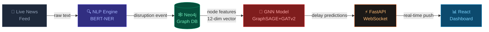

<div align="center">

<!-- ANIMATED TITLE BANNER -->
<picture>
  <source media="(prefers-color-scheme: dark)" srcset="https://readme-typing-svg.demolab.com?font=Fira+Code&weight=700&size=40&duration=3000&pause=1000&color=00D9FF&center=true&vCenter=true&width=700&height=70&lines=AtmoGraph+%F0%9F%8C%90;Supply+Chain+AI+Platform;Ripple+Effect+Predictor">
  
</picture>

<br/>

<p align="center">
  <strong>AI-powered Graph Neural Network platform that predicts how a localized disruption<br/>ripples across the entire global supply chain — in real time.</strong>
</p>

<br/>

<!-- BADGES ROW 1 — TECH STACK -->
<p align="center">
  
  
  
  
</p>

<!-- BADGES ROW 2 — INFRASTRUCTURE -->
<p align="center">
  
  
  
  
</p>

<!-- BADGES ROW 3 — STATUS -->
<p align="center">
  
  
  
</p>

<br/>

<!-- QUICK LINKS -->
<p align="center">
  <a href="#-live-demo"><strong>🎥 Demo</strong></a> &nbsp;·&nbsp;
  <a href="#%EF%B8%8F-quick-start"><strong>⚡ Quick Start</strong></a> &nbsp;·&nbsp;
  <a href="#-system-architecture"><strong>🏗 Architecture</strong></a> &nbsp;·&nbsp;
  <a href="#-api-reference"><strong>📡 API</strong></a> &nbsp;·&nbsp;
  <a href="#-team"><strong>👥 Team</strong></a>
</p>

<br/>

---

</div>

## 🎯 The Problem

> Traditional supply chain models treat disruptions in **isolation**. They fail to model the **complex, multi-hop dependencies** of the real global economy.

When a port strike hits Rotterdam, it doesn't just affect Dutch logistics — within weeks it cascades into semiconductor shortages in Taiwan, factory slowdowns in Shenzhen, and empty shelves in North American electronics retail. **No existing tool maps this automatically.**

<br/>

## 💡 Our Solution

**AtmoGraph** is an enterprise-grade AI platform that:

| Capability | How |
|------------|-----|
| 🔍 **Detects disruptions** from live news, in real time | BERT-NER NLP pipeline |
| 🕸️ **Models global supply chain** as an interconnected graph | Neo4j Graph Database |
| 🧠 **Predicts ripple effects** across multi-hop nodes | Graph Neural Network (GraphSAGE + GATv2) |
| 📊 **Visualizes risk** on an interactive dashboard | React + React Flow / D3.js |
| ⚡ **Streams predictions** to all connected clients instantly | FastAPI WebSocket |

<br/>

## 🎬 Live Demo

> *"A port strike just broke in Rotterdam. Watch AtmoGraph predict a 67-day delay in North American consumer electronics — in under 500ms."*

```
[Dashboard Screenshot / GIF will go here — Dimple's deliverable]
```

<br/>

---

## 🏗️ System Architecture

<div align="center">

```
╔══════════════════════════════════════════════════════════════════════════╗
║                        ATMOGRAPH PLATFORM                               ║
╠══════════════╦═══════════════╦════════════════════╦═════════════════════╣
║              ║               ║                    ║                     ║
║  📰 NEWS     ║  🕸️  NEO4J    ║  🧠 GNN ENGINE     ║  📊 REACT DASH     ║
║  INGESTION   ║  GRAPH DB     ║  PyTorch Geometric ║  React Flow/D3.js  ║
║              ║               ║                    ║                     ║
║  spaCy/BERT  ║  Suppliers    ║  GraphSAGE         ║  Interactive Map   ║
║  NER Engine  ║  Ports        ║  3 × message-pass  ║  Risk Overlays     ║
║  Entity Link ║  Factories    ║  GATv2 attention   ║  Timeline Slider   ║
║  Severity ↑  ║  Routes       ║  Node Regression   ║  Live WebSocket    ║
║              ║               ║                    ║                     ║
╠══════════════╩═══════════════╩════════════════════╩═════════════════════╣
║                   ⚡ FastAPI + WebSocket Real-Time Layer                ║
╠══════════════════════════════════════════════════════════════════════════╣
║                    🗄️ Redis Message Queue & Cache                       ║
╚══════════════════════════════════════════════════════════════════════════╝
```

</div>

### Data Flow



<br/>

---

## ✨ Key Features

<table>
<tr>
<td width="50%">

### 🧠 Graph Neural Network
- **GraphSAGE** message-passing (3 layers)
- **GATv2** attention for interpretability
- **Node regression** → predicts `delay_days` per node
- **12-dimensional** feature vector per node
- **DisruptionAwareGNN** with hop-decay propagation

</td>
<td width="50%">

### 🗺️ Neo4j Supply Chain Graph
- **6 node types**: Supplier, Manufacturer, Port, DC, Retailer, Product
- **6 edge types**: SUPPLIES, MANUFACTURES, SHIPS_THROUGH, ROUTES_TO, DISTRIBUTES, SELLS
- **Real-world data**: Rotterdam, Shanghai, Singapore, LA, Hamburg
- **200+ nodes, 500+ edges** for training

</td>
</tr>
<tr>
<td width="50%">

### 🔍 NLP Disruption Engine
- **BERT-NER** (`dslim/bert-base-NER`) entity extraction
- Detects: `strike`, `flood`, `geopolitical`, `fire`, `pandemic`
- **Entity linking**: location → supply chain node
- Severity scoring `[0.0 → 1.0]`

</td>
<td width="50%">

### 📊 Interactive Dashboard
- **Real-time** graph with zoom, pan, search
- **Risk color overlay**: 🔴 Critical → 🟠 High → 🟡 Medium → 🟢 Low
- **30 / 60 / 90-day** timeline slider
- **WebSocket** live updates (no polling)

</td>
</tr>
</table>

<br/>

---

## 📁 Project Structure

```
atmograph/
│
├── 📂 backend/
│   ├── 🧠 gnn/
│   │   ├── model.py          ← GraphSAGE + GATv2 architecture
│   │   ├── features.py       ← Neo4j → 12-dim PyG tensor conversion
│   │   ├── trainer.py        ← Huber loss + CosineAnnealingLR
│   │   └── inference.py      ← Real-time + 30/60/90-day prediction
│   │
│   ├── ⚡ api/
│   │   ├── main.py           ← FastAPI app factory + WebSocket
│   │   ├── websocket.py      ← Real-time broadcast manager
│   │   └── routes/
│   │       ├── graph.py      ← GET /api/graph/
│   │       ├── predictions.py← POST /api/predict/ & /timeline
│   │       ├── disruptions.py← POST /api/disrupt/
│   │       └── health.py     ← GET /health/
│   │
│   ├── 🔍 nlp/               ← Fathima's NLP pipeline
│   │   ├── pipeline.py
│   │   ├── ner_extractor.py
│   │   └── entity_linker.py
│   │
│   ├── 🗄️ database/          ← Shubhangi's Neo4j layer
│   │   ├── connector.py      ← Connection pool
│   │   └── queries.py        ← Cypher query library
│   │
│   └── ⚙️ config/
│       └── settings.py       ← Pydantic environment settings
│
├── 📂 frontend/              ← Dimple's React dashboard
├── 📂 data/mock/             ← Mock supply chain datasets
├── 📂 scripts/cypher/        ← Neo4j ingestion scripts
├── 📂 docs/architecture/     ← Architecture diagrams
│
├── 🐳 docker-compose.yml     ← Full stack orchestration
├── 📋 requirements.txt       ← Python dependencies
└── 🔐 .env.example           ← Environment variable template
```

<br/>

---

## ⚡ Quick Start

### Prerequisites

| Tool | Version | Install |
|------|---------|---------|
| Docker Desktop | Latest | [docker.com](https://docker.com) |
| Python | 3.10+ | [python.org](https://python.org) |
| Node.js | 18+ | [nodejs.org](https://nodejs.org) |
| Git | Latest | [git-scm.com](https://git-scm.com) |

<br/>

### 🐳 Option A: Docker (Recommended — One Command)

```bash
# 1. Clone the repository
git clone https://github.com/patelmegh1234/Infotach_Internship_DSML_2.git
cd Infotach_Internship_DSML_2/atmograph

# 2. Configure environment
cp .env.example .env
# Edit .env with your Neo4j password and HuggingFace token

# 3. Launch ALL services (Neo4j + Redis + Backend + NLP Worker + Frontend)
docker-compose up -d

# 4. Check all services are healthy
docker-compose ps
```

| Service | URL | Credentials |
|---------|-----|-------------|
| 📊 React Dashboard | http://localhost:3000 | — |
| 📡 FastAPI Docs | http://localhost:8000/docs | — |
| 🕸️ Neo4j Browser | http://localhost:7474 | neo4j / atmograph2026 |

<br/>

### 🐍 Option B: Local Development

```bash
# Backend
cd atmograph
python -m venv venv && source venv/bin/activate   # Windows: venv\Scripts\activate
pip install -r requirements.txt
python -m spacy download en_core_web_sm
uvicorn backend.api.main:app --reload --port 8000

# Frontend (new terminal)
cd atmograph/frontend
npm install
npm run dev
```

<br/>

---

## 📡 API Reference

<details>
<summary><b>🕸️ Graph Endpoints</b></summary>

```http
GET /api/graph/
```
Returns the full supply chain graph (nodes + edges) for dashboard rendering.

```http
GET /api/graph/node/{node_id}
```
Get detailed properties of a single supply chain node.

```http
GET /api/graph/stats
```
High-level graph statistics (node counts by type, total edges).

</details>

<details>
<summary><b>🧠 Prediction Endpoints</b></summary>

```http
POST /api/predict/
Content-Type: application/json

{
  "node_id":         "port_rotterdam_001",
  "risk_score":      0.9,
  "disruption_flag": true,
  "severity":        0.85,
  "description":     "Port workers begin indefinite strike"
}
```
Triggers GNN inference → returns delay predictions for all downstream nodes.

```http
POST /api/predict/timeline
Content-Type: application/json

{
  "disruption": { "node_id": "port_rotterdam_001", "severity": 0.85 },
  "horizons": [30, 60, 90]
}
```
Returns predicted supply chain state at 30, 60, and 90 days out.

</details>

<details>
<summary><b>🔍 Disruption Endpoints (NLP → API)</b></summary>

```http
POST /api/disrupt/
Content-Type: application/json

{
  "disruption_id":          "evt_20260820_001",
  "node_id":                "port_rotterdam_001",
  "node_type":              "Port",
  "disruption_type":        "strike",
  "location":               "Rotterdam, Netherlands",
  "severity":               0.85,
  "estimated_duration_days": 14,
  "source_headline":        "Port workers begin indefinite strike"
}
```

```http
GET  /api/disrupt/active          ← All currently disrupted nodes
DELETE /api/disrupt/{id}          ← Resolve a disruption
```

</details>

<details>
<summary><b>⚡ WebSocket (Real-Time)</b></summary>

```javascript
// Connect from React dashboard
const ws = new WebSocket('ws://localhost:8000/ws/client-001');

ws.onmessage = (event) => {
  const msg = JSON.parse(event.data);

  if (msg.type === 'predictions_updated') {
    // msg.predictions → array of {node_id, delay_days, confidence, risk_level}
    updateGraphColors(msg.predictions);
  }

  if (msg.type === 'disruption_detected') {
    // msg.disruption → full disruption event object
    showDisruptionAlert(msg.disruption);
  }
};
```

</details>

<br/>

---

## 📊 Graph Schema

<div align="center">

```
     [Supplier] ──SUPPLIES──► [Manufacturer] ──MANUFACTURES──► [Product]
         │                          │
   SHIPS_THROUGH              SHIPS_THROUGH
         │                          │
         ▼                          ▼
       [Port] ─────ROUTES_TO──► [Port]
         │
    DISTRIBUTES
         │
         ▼
 [DistributionCenter] ──SELLS──► [Retailer]
```

</div>

### Node Properties (GNN Feature Vector — 12 dimensions)

| # | Feature | Type | Range |
|---|---------|------|-------|
| 0–5 | `node_type` one-hot | float | {0, 1} — 6 classes |
| 6 | `risk_score` | float | [0.0, 1.0] |
| 7 | `disruption_flag` | float | {0, 1} |
| 8 | `disruption_severity` | float | [0.0, 1.0] |
| 9 | `historical_delay_avg` (norm) | float | [0.0, 1.0] |
| 10 | `capacity_utilization` | float | [0.0, 1.0] |
| 11 | `geo_importance_score` | float | [0.0, 1.0] |

<br/>

---

## 🗓️ Development Roadmap

```
AUGUST 2026                                    SEPTEMBER 2026
─────────────────────────────────────────────────────────────────────►
 Aug 13          Aug 27      Aug 28       Sep 3           Sep 10  Sep 13
    │               │           │            │               │       │
    ├──── WEEK 1+2 ─┤     MID   ├── WEEK 3 ──┤──── WEEK 4 ──┤ FINAL │
    │  Graph DB     │  REVIEW   │  GNN Train │  WebSocket   │ DEMO  │
    │  NLP Engine   │    ✅     │  Risk UI   │  Timeline UI │       │
    │  React Base   │           │  Inference │  Polish      │       │
    └───────────────┴───────────┴────────────┴──────────────┴───────┘
         CATCH-UP SPRINT ◄──────────────── 3 WEEKS REMAINING ───────►
```

| Phase | Dates | Backend | Frontend | Status |
|-------|-------|---------|----------|--------|
| **Week 1+2** | Aug 13–27 | Graph DB + NLP + GNN skeleton + FastAPI | React scaffold + API connection + zoom/pan | 🟡 In Progress |
| **Mid-Review** | Aug 28 | NLP → Neo4j live demo | 500-node render test | ⬜ Upcoming |
| **Week 3** | Aug 29–Sep 3 | GNN training + live inference | Risk color overlay + WebSocket | ⬜ Upcoming |
| **Week 4** | Sep 4–10 | End-to-end integration + testing | 30/60/90-day slider + polish | ⬜ Upcoming |
| **Final** | Sep 13 | Full pipeline demo | Enterprise dashboard | ⬜ Upcoming |

<br/>

---

## 👥 Team

<div align="center">

<table>
<tr>
<td align="center" width="25%">
<a href="https://github.com/patelmegh1234">
<br/>
<b>Megh Patel</b>
</a><br/>
<sub>🏆 Team Leader</sub><br/>
<sub>GNN · FastAPI · Architecture</sub><br/>

</td>
<td align="center" width="25%">
<a href="https://github.com/Shubhangimane2005">
<br/>
<b>Shubhangi</b>
</a><br/>
<sub>🗄️ Data Engineer</sub><br/>
<sub>Neo4j · Cypher · Graph Data</sub><br/>

</td>
<td align="center" width="25%">
<a href="https://github.com/Fathima2002Y">
<br/>
<b>Fathima</b>
</a><br/>
<sub>🔍 NLP Engineer</sub><br/>
<sub>spaCy · HuggingFace · NER</sub><br/>

</td>
<td align="center" width="25%">
<a href="https://github.com/Dimple-S1163">
<br/>
<b>Dimple</b>
</a><br/>
<sub>🎨 Frontend Engineer</sub><br/>
<sub>React · D3.js · React Flow</sub><br/>

</td>
</tr>
</table>

</div>

<br/>

---

## 🌿 Branch Strategy

```
main  (protected — PR required + review)
│
├── megh/week1-week2-architecture-gnn    ✅ MERGED
├── megh/week3-gnn-training              ← Week 3
├── megh/week4-integration               ← Week 4
│
├── shubhangi/week1-neo4j-schema         ← Create this branch
├── shubhangi/week2-cypher-data
│
├── fathima/week2-nlp-pipeline           ← Create this branch
├── fathima/week3-nlp-worker
│
└── dimple/week1-react-scaffold          ← Create this branch
    dimple/week3-risk-overlay
    dimple/week4-timeline-slider
```

> **Rule**: Never push directly to `main`. Always open a PR and request a review from Megh.

<br/>

---

## 🛠️ Tech Stack

<div align="center">

| Layer | Technology | Version | Purpose |
|-------|-----------|---------|---------|
| **Graph DB** |  | 5.18 | Store & query global supply chain network |
| **GNN** |  | 2.5.3 | Ripple-effect delay prediction |
| **NLP** |  | 4.40 | BERT-NER disruption entity extraction |
| **API** |  | 0.111 | REST + WebSocket real-time streaming |
| **Frontend** |  | 18 | Interactive supply chain visualization |
| **Cache** |  | 7.2 | Message queue & prediction cache |
| **DevOps** |  | Latest | Multi-service orchestration |

</div>

<br/>

---

## 🤝 Contributing

1. **Fork & clone** the repository
2. **Create your branch** from `main` following the naming convention:
   ```bash
   git checkout -b yourname/feature-description
   # e.g. git checkout -b dimple/week3-risk-overlay
   ```
3. **Commit** with clear messages:
   ```bash
   git commit -m "feat(nlp): add BERT-NER entity extraction pipeline"
   #             ^ type  ^ scope  ^ description
   ```
   Commit types: `feat` · `fix` · `docs` · `test` · `refactor` · `chore`
4. **Push** and open a **Pull Request** to `main`
5. Request review from **@patelmegh1234** before merging

<br/>

---

<div align="center">

**Built with ❤️ by Team AtmoGraph — InfoTach DSML Internship 2026**

<br/>


<br/><br/>

*"The butterfly effect of global trade — visualized and predicted."*

</div>
